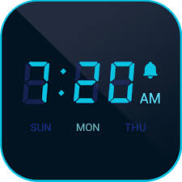

## You choose to sleep

You fall back to sleep.  
Not long after you hear another alarm, you are sure that it has only been a few minutes so you look at the clock, 7:20 am.

  
[Credit](https://www.facebook.com/Clock-Master-1763573957032710/)

Do you [wake up now?](choice1/wakeup2.md)

Or

Continue to [sleep?](choice2/snooze2.md)